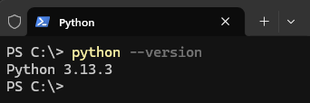

# Configuración del Ambiente

**1. Instalar y verificar la version de Python**

Como primer paso, descarga e instala python3 de https://www.python.org/downloads/ (elige el método de instalación dependiendo del Sistema Operativo).

Una vez instalado, verifica la versión:

```python
python --version
```

Si la instalación se realizó correctamente, la salida del comando anterior debería ser similar a:



**2. Creación del entorno virtual**

Este proyecto usa **Pipenv** para asegurar que el equipo pueda configurar sub ambiente correctamente.

Si no tienes Pipenv, ejecuta:

```python
pip install pipenv
```

Instalación de dependencias:

```python
pipenv install
```

Este comando lee el archivo Pipfile, instala las librerias, y crea un archivo Pipfile.lock para manejar las versiones.

Para activar el ambiente:

```python
pipenv shell
```

**3. Instalación de nuevas librerías**

- Para agregar nuevas librerias, usar **pipenv install \<package-name\>**:

    ```python
    pipenv install plotly
    ```

- Control de versiones: Siempre subir los cambios de ambos Pipfile y Pipfile.lock a Git. Esto asegura que el proyecto sea reproducible para el equipo.